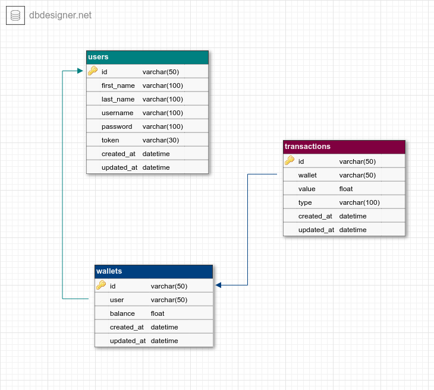

# Demo Credit API

[](https://github.com/struckchure/demo-credits/actions/workflows/aws-deploy.yml)

Demo Credit is a wallet service. This is needed as borrowers need a wallet to receive the loans they have been granted and also send the money for repayments.

## ER Diagram



## API Documentation

Base URL: `https://mohammed-lendsqr-be-test.struckchure.com`
Default headers:

```json
{
  "Content-Type": "application/json",
  "Accept": "application/json"
}
```

# user endpoints

- `GET /api/v1/user/register` - Register a user

Sample Payload:
All fields are required for registering a user.

```json
{
  "username": "username",
  "password": "password"
}
```

Sample Response(201):

```json
{
  "data": {
    "id": "<user_id>",
    "username": "username",
    "password": "password",
    "token": "<token>",
    "created_at": "2020-05-01T00:00:00Z",
    "updated_at": "2020-05-01T00:00:00Z"
  }
}
```

- `POST /api/v1/user/login` - Login a user / obtain a token

Sample Payload:
All fields are required for logging in a user.

```json
{
  "username": "username",
  "password": "password"
}
```

Sample Response (200):

```json
{
  "data": {
    "id": "<user_id>",
    "username": "username",
    "token": "<token>",
    "created_at": "2020-05-01T00:00:00Z",
    "updated_at": "2020-05-01T00:00:00Z"
  }
}
```

# wallet endpoints

Authentication is required for all wallet endpoints. Tokens are obtained from the user endpoints.
Default headers:

```json
{
  "Content-Type": "application/json",
  "Accept": "application/json",
  "Authorization": "Bearer <token>"
}
```

- `POST /api/v1/wallet` - Create a wallet

Sample Payload: No payload is required for creating a wallet.

Sample Response (201):

```json
{
  "data": {
    "id": "<wallet_id>",
    "user": "<user_id>",
    "balance": 0,
    "created_at": "2020-05-01T00:00:00Z",
    "updated_at": "2020-05-01T00:00:00Z"
  }
}
```

- `GET /api/v1/wallet` - Get a user's wallet

Sample Response(200):

```json
{
  "data": {
    "id": "<wallet_id>",
    "user": "<user_id>",
    "balance": 0,
    "created_at": "2020-05-01T00:00:00Z",
    "updated_at": "2020-05-01T00:00:00Z"
  }
}
```

- `POST /api/v1/wallet/fund` - Fund a wallet

Sample Payload:
All fields are required for funding a wallet.

```json
{
  "amount": 100
}
```

Sample Response(200):

```json
{
  "data": {
    "id": "<wallet_id>",
    "user": "<user_id>",
    "balance": 100,
    "created_at": "2020-05-01T00:00:00Z",
    "updated_at": "2020-05-01T00:00:00Z"
  }
}
```

- `POST /api/v1/wallet/withdraw` - Withdraw from a wallet

Sample Payload:
All fields are required for withdrawing from a wallet.

```json
{
  "amount": 100
}
```

Sample Response(200):

```json
{
  "data": {
    "id": "<wallet_id>",
    "user": "<user_id>",
    "balance": 0,
    "created_at": "2020-05-01T00:00:00Z",
    "updated_at": "2020-05-01T00:00:00Z"
  }
}
```

- `POST /api/v1/wallet/transfer` - Transfer money from one user to another

Sample Payload:
All fields are required for transferring money from one user to another.

```json
{
  "amount": 100,
  "username": "<username>"
}
```

Sample Response(200):

```json
{
  "data": {
    "id": "<wallet_id>",
    "user": "<user_id>",
    "balance": 0,
    "created_at": "2020-05-01T00:00:00Z",
    "updated_at": "2020-05-01T00:00:00Z"
  }
}
```
